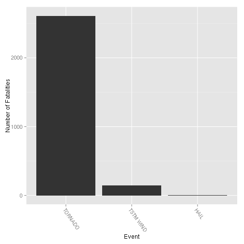
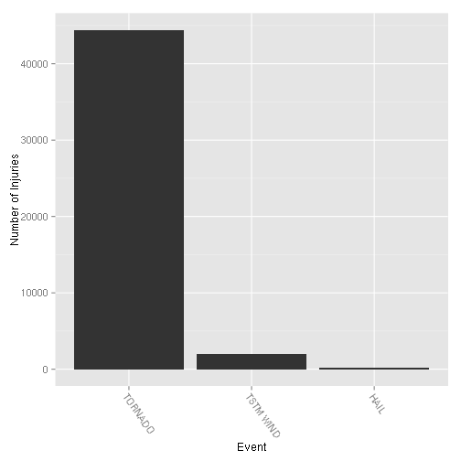
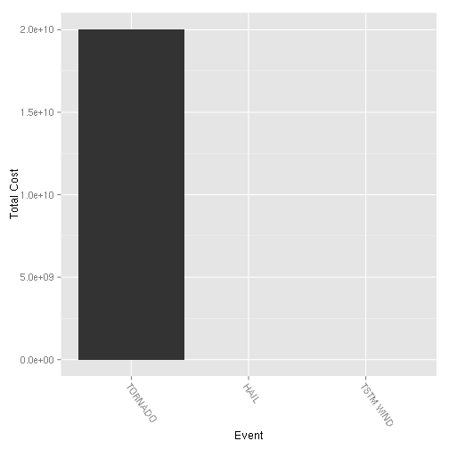

# Synopsis
This project investigates the NOAA Storm database to determine which storm events are most harmful and which are the most costly. We arrive at the conclusion that tornadoes cause the most harm to the population, and that floods cause the most economic damage. To arrive at this conclusion a tidy summarised dataset needed to be constructed from the raw data provided by NOAA. From this tidy dataset we can show that the conclusion is accurate.

# Data Processing
The source data can be obtained from this url
```
https://d396qusza40orc.cloudfront.net/repdata%2Fdata%2FStormData.csv.bz2
```
The data is then uncompressed into the file `StormData.csv`.

We're only really interested in a few variables
* EVTYPE - Event Type
* FATALITIES - Reported fatalities
* INJURIES - Reported injuries
* PROPDMG - Property damage
* PROPDMGEXP - Magnitude of property damage (exponent)
* CROPDMG - Crop damage
* CROPDMGEXP - Magnitude of crop damage (exponent)


```r
library('plyr')
library('sqldf')
data <- read.csv('StormData.csv', nrows=100000)
```

## Health related variables

The variables relevant for this data are `FATALITIES` and `INJURIES`.

## Economic consequences

Similarly to the above we need to get a relevant data set that highlight economic consequence. In order to do this we need to summarise `PROPDMG` and `CROPDMG`, taking into account the related `PROPDMGEXP` and `CROPDMGEXP` which refer to the magnitude of the former. The first step is to make sure we translate the damages into an actual number.


```r
union(
  levels(data$PROPDMGEXP),
  levels(data$CROPDMGEXP)
)
```

```
## [1] ""  "K" "M"
```

We first need to convert the exponent columns to integer so they make sense.


```r
data$PROPDMGEXP <- as.character(data$PROPDMGEXP)
data$PROPDMGEXP[data$PROPDMGEXP=='' | data$PROPDMGEXP=='?' | data$PROPDMGEXP=='+'] <- 0
data$PROPDMGEXP[data$PROPDMGEXP=='h' | data$PROPDMGEXP=='H'] <- 2
data$PROPDMGEXP[data$PROPDMGEXP=='k' | data$PROPDMGEXP=='K'] <- 3
data$PROPDMGEXP[data$PROPDMGEXP=='m' | data$PROPDMGEXP=='M'] <- 6
data$PROPDMGEXP[data$PROPDMGEXP=='B'] <- 9
data$PROPDMGEXP <- as.integer(data$PROPDMGEXP)

data$CROPDMGEXP <- as.character(data$CROPDMGEXP)
data$CROPDMGEXP[is.na(data$CROPDMGEXP) | data$CROPDMGEXP=='' | data$CROPDMGEXP=='?' | data$CROPDMGEXP=='+'] <- 0
data$CROPDMGEXP[data$CROPDMGEXP=='h' | data$CROPDMGEXP=='H'] <- 2
data$CROPDMGEXP[data$CROPDMGEXP=='k' | data$CROPDMGEXP=='K'] <- 3
data$CROPDMGEXP[data$CROPDMGEXP=='m' | data$CROPDMGEXP=='M'] <- 6
data$CROPDMGEXP[data$CROPDMGEXP=='B'] <- 9
data$CROPDMGEXP <- as.integer(data$CROPDMGEXP)

data$DMGSUM <- data$PROPDMG * 10 ^ data$PROPDMGEXP + data$CROPDMG * 10 ^ data$CROPDMGEXP
```

We've now created a column that summarises in `DMGSUM`.


## Summary Dataset


```r
summary <- ddply(data, .(EVTYPE), summarize, cost = sum(DMGSUM), injuries = sum(INJURIES), fatalities = sum(FATALITIES))
```

We've now prepared a `summary` dataset that will be used in getting the results we're interested in.

# Results
We will display the results using ggplot2 and use sqldf to filter out useful information from the `summary` dataset.


```r
library('ggplot2')
library('sqldf')
```
## Most Harmful Event

```r
fatalities <- sqldf('SELECT EVTYPE, fatalities FROM summary ORDER BY fatalities DESC LIMIT 10')
fatalities$EVTYPE <- factor(fatalities$EVTYPE, fatalities$EVTYPE)
injuries <- sqldf('SELECT EVTYPE, injuries FROM summary ORDER BY injuries DESC LIMIT 10')
injuries$EVTYPE <- factor(injuries$EVTYPE, injuries$EVTYPE)
ggplot(data = fatalities, aes(x=EVTYPE, y=fatalities)) + geom_bar(stat='identity') + xlab('Event') + ylab('Number of Fatalities') + theme(axis.text.x = element_text(angle=-55, hjust=0))
```

 

```r
print(fatalities)
```

```
##      EVTYPE fatalities
## 1   TORNADO       2609
## 2 TSTM WIND        148
## 3      HAIL          4
```

```r
ggplot(data = injuries, aes(x=EVTYPE, y=injuries)) + geom_bar(stat='identity') + xlab('Event') + ylab('Number of Injuries') + theme(axis.text.x = element_text(angle=-55, hjust=0))
```

 

```r
print(injuries)
```

```
##      EVTYPE injuries
## 1   TORNADO    44405
## 2 TSTM WIND     2014
## 3      HAIL      225
```

The most fatal event is `TORNADO`. Since it is also the event with the most number of injuries, it is possible to conclude without making any further judgements that this is the single most harmful event to population health.


## Most costly Event

```r
costly <- sqldf('SELECT EVTYPE, cost FROM summary ORDER BY cost DESC LIMIT 10')
costly$EVTYPE <- factor(costly$EVTYPE, costly$EVTYPE)
ggplot(data = costly, aes(x=EVTYPE, y=cost)) + geom_bar(stat='identity') + xlab('Event') + ylab('Total Cost') + theme(axis.text.x = element_text(angle=-55, hjust=0))
```

 

```r
print(costly)
```

```
##      EVTYPE      cost
## 1   TORNADO 2.003e+10
## 2      HAIL 0.000e+00
## 3 TSTM WIND 0.000e+00
```

The most costly event is quite clearly `FLOOD` 


